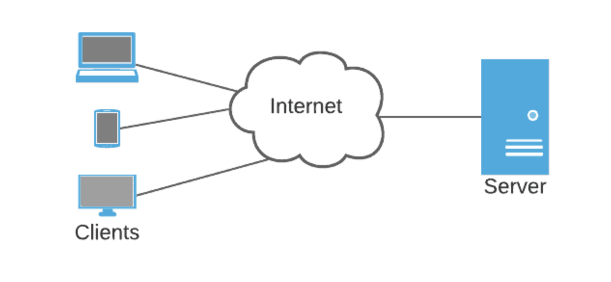
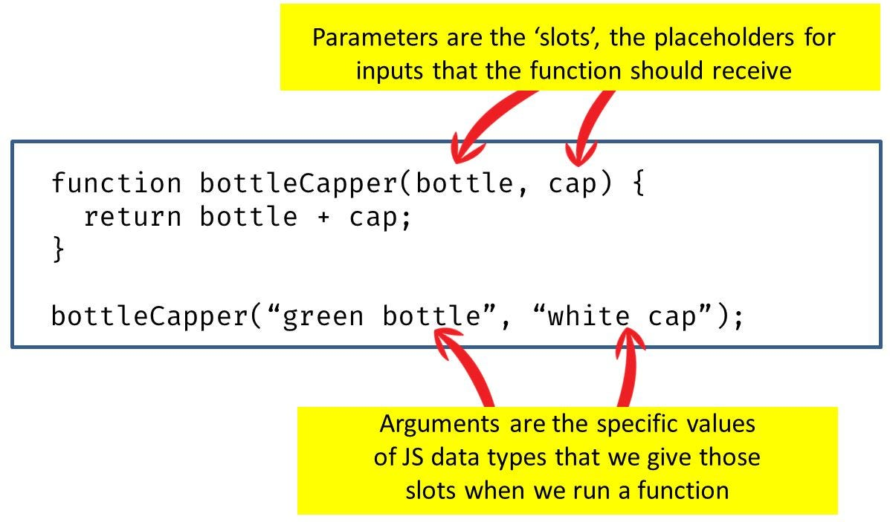

# CodeCamp-JavascriptBasics

### Concept Review

1. What is the Command Line Interface (CLI)?
2. What is the terminal and git bash?
3. What is the difference between a folder and directory?
4. What is a file?

### Hands-On Review

5. On the CLI, how do you:

- create a folder/directory
- delete a folder/directory
- create a file
- delete a file
- change directory location to the root folder
- list the folders and files within a directory
- open VS Code with the CLI

# New Concepts, part 1

1. Client computers use browsers to connect to server computers.  
   For example, a user on their laptop or phone connects to the facebook application and database

2. Javascript is a coding language that can run in browser or server environments

3. NodeJS allows javascript to run in server environments

4. You can use your personal computer as a server to run NodeJS applications

# Hands On Instructions, part 1

1. On the CLI, navigate to the root folder (cd ~)
2. List all folders and files (ls)
3. You should see a folder named "code-projects"
4. Change directory into "code-projects" (cd code-projects)
5. Inside code-projects, create a folder named "javascript-basics" (mkdir javascript-basics)
6. Change directory into javascript-basics (cd javascript-basics)
7. Create a file named code.js (touch index.js)
8. Create another file named code.test.js (touch index.js)
9. Open up VS Code (code .)
10. Copy and Paste this code into index.test.js
11. run the command "npm install --save-dev jest" inside the "javascript-basics folder

# New Concepts, part 2

Data Types

- Boolean: Represents true or false.
- Number: Integer or floating-point value.
- String: Sequence of characters.
- Array: Ordered collection of elements.
- Object: Collection of key-value pairs for storing data.

New Concepts

- Variable: Symbolic name for storing data.
- Function: Block of code for a specific task.

# Hands On Instructions, part 2

- Complete javascript-basics
